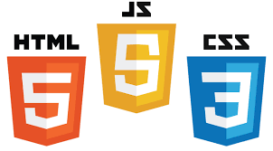

# English-Grammar-js
demo:https://pavelcydep.github.io/English-Grammar-js/

Возможности использования
=========================
- Проверка на знание английского языка.
- Возможность пополнить словарный запас.

Как установить проект?
================
## Для начала работы вам необходим:

### Склонировать проект на ПК:

    git clone 
   

Стек технологий
===============
  

 

Планы по доработке
==================
- сделать то же самое приложение с помощью React. 
